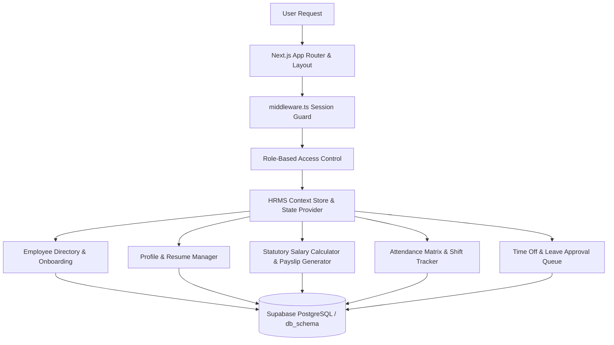

# Dayflow HRMS — Human Resource Management System

[](https://nextjs.org/)
[](https://www.typescriptlang.org/)
[](https://tailwindcss.com/)
[](https://supabase.com/)

**Dayflow HRMS** (*Every workday, perfectly aligned.*) is a modern enterprise Human Resource Management System designed to streamline employee onboarding, live shift punching, profile management, statutory salary calculations, and leave approval workflows in a sleek **Standard Black & White (Monochrome)** design system.

---

## 📐 System Architecture

The system coordinates role-aware modules, session security middleware, and a real-time state engine connected to Supabase:



---

## ✨ Key Features

### 🏢 Employee Directory & Onboarding
- **Live Status Badges**: Real-time status indicators (🟢 Present, 🟡 Absent, 🌓 Half-Day, ✈️ On Leave).
- **Custom Login ID Generator**: Automatically generates unique employee Login IDs (`OIFILASTYYYYSEQ`) upon onboarding.
- **Search & Filters**: Instant search by name, Login ID, or email with department filtering.

### 👤 Profile & Resume Management
- **3-Tab Profile View**:
  - **Resume Tab**: Bio, "What I love about my job", hobbies, skills, and certifications.
  - **Private Info Tab**: Residing address, personal email, nationality, DOB, marital status, PAN No, UAN No, and bank details.
  - **Salary Info Tab**: Admin-only statutory breakdown and payslip generator.

### 💰 Statutory Salary Engine & Payslip Generator
- **Flexible Wage Input**: Switch between Monthly Wage and Annual CTC.
- **Automated Components**: Auto-calculates Basic (50%), HRA (50% of Basic), Standard Allowance (8.33%), Performance Bonus (8.33% of Basic), LTA (8.333% of Basic), Fixed Allowance, PF (12%), and Professional Tax (₹200).
- **Official Payslip Report**: One-click printable payslip report modal.

### ⏱️ Attendance & Shift Tracking
- **Live Shift Widget**: Check In / Check Out with real-time shift timer and notes.
- **Shift Matrix**: Daily organizational view for HR with date selector and presence summary.
- **Half-Day Tracking**: Supports half-day shift logging and break time tracking.

### 📅 Time Off & Leave Management
- **Leave Balances**: Tracks 24 Days Paid Time Off (PTO) and 7 Days Sick Leave.
- **Medical Certificate Attachment**: Attach medical certificates and supporting proofs to requests.
- **HR Approval Queue**: Inline Approve and Reject controls with response comment logging.

---

## 🛠️ Technology Stack

| Layer | Technologies |
|---|---|
| **Frontend** | Next.js 14 (App Router), React 18, TypeScript, Tailwind CSS, Lucide Icons |
| **Authentication & Middleware** | Next.js Middleware, Cookie-based Session Guard |
| **Database** | Supabase PostgreSQL (`db_schema/schema.sql`) |
| **State Management** | React Context API with LocalStorage fallback resilience |

---

## 🚀 Quick Start

### 1. Clone & Install
```bash
git clone <repository-url>
cd hrms
npm install
```

### 2. Environment Setup
Create a `.env.local` file:
```env
NEXT_PUBLIC_SUPABASE_URL=https://xczcsqaxgbgwlhzhgldi.supabase.co
NEXT_PUBLIC_SUPABASE_ANON_KEY=your_supabase_anon_key
SUPABASE_SERVICE_ROLE_KEY=your_supabase_service_role_key
```

### 3. Run Development Server
```bash
npm run dev
```
Open [http://localhost:3000](http://localhost:3000) in your browser.

### 4. Build Verification
```bash
npm run build
```

## Local setup

```bash
npm install
cp .env.example .env.local   # then fill in the Supabase values
npm run dev
```

`.env.local` is gitignored — get the development values from the team rather
than committing them.

### Database

`db_schema/schema.sql` mirrors the live Supabase project. Optional additive
columns live in `db_schema/migrations/` — the app runs without them and simply
does not persist those fields (see `src/lib/supabase/write.ts`).
