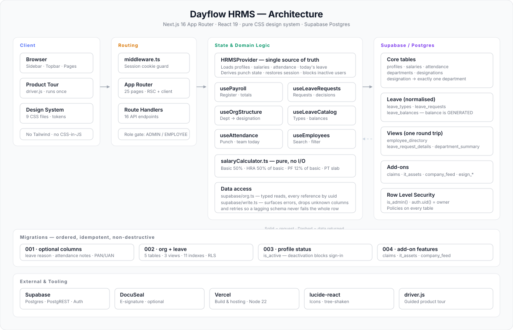
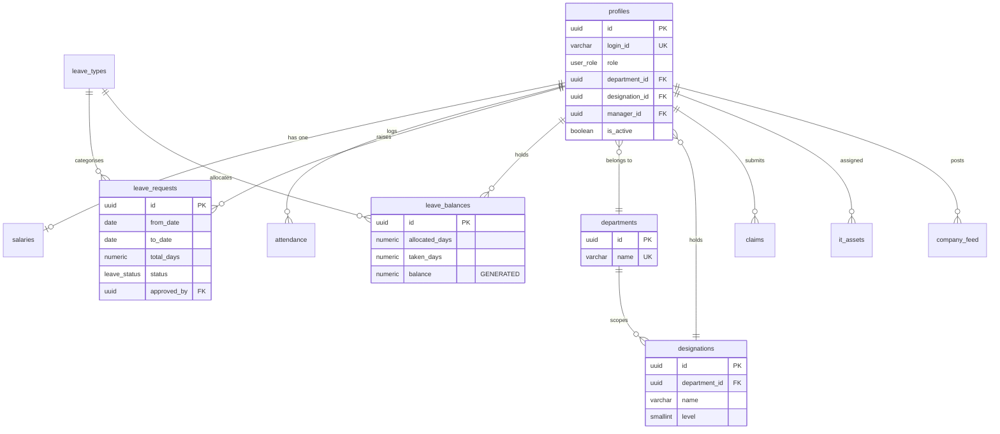
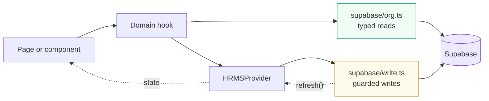
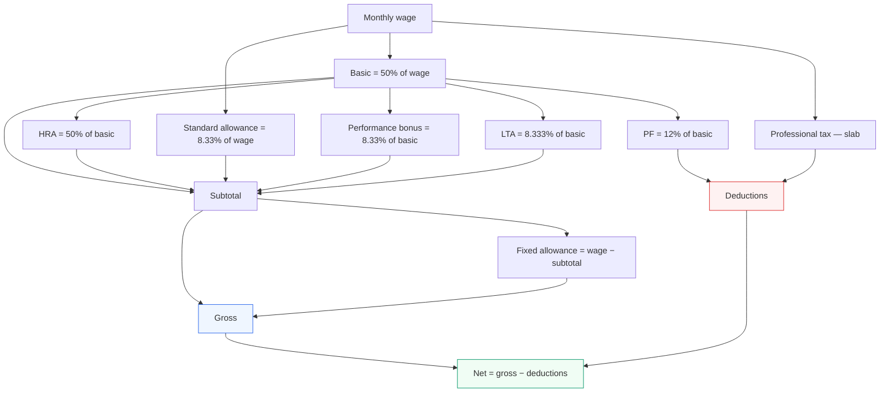
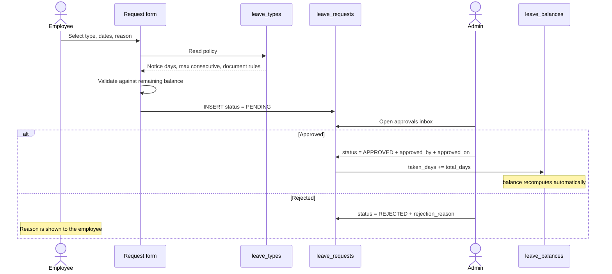

# Dayflow HRMS

A human resource management system covering the full employee lifecycle — directory and org structure, attendance, leave with approvals, and statutory payroll — built on Next.js 16 and Supabase.

[](https://nextjs.org/)
[](https://react.dev/)
[](https://www.typescriptlang.org/)
[](https://supabase.com/)
[](https://oodo-hackathon-chi.vercel.app/)

---

## Architecture



Four layers, one direction of travel. The browser talks to the App Router, which is guarded by middleware; pages read state from a single provider; that provider is the only thing that talks to Supabase. Domain maths lives in a pure module with no I/O, so it can be reasoned about — and tested — without a database.

---

## Table of contents

- [What it does](#what-it-does)
- [Tech stack](#tech-stack)
- [Getting started](#getting-started)
- [Environment variables](#environment-variables)
- [Database](#database)
- [How the data layer works](#how-the-data-layer-works)
- [Payroll calculation](#payroll-calculation)
- [Leave lifecycle](#leave-lifecycle)
- [Design system](#design-system)
- [Project structure](#project-structure)
- [Scripts](#scripts)
- [Deployment](#deployment)
- [Known limitations](#known-limitations)
- [Test account](#test-account)

---

## What it does

### People & org structure
Searchable employee directory with live presence badges, department filtering, and a three-tab profile (General, Private Info, Salary). Departments and designations are **normalised tables**, not free text — and every designation belongs to exactly one department, enforced by a composite unique constraint. The employee form uses cascading ID-based dropdowns, so choosing a department narrows the designation list and changing it clears any stale selection.

Employees can be **deactivated** rather than deleted: records, payslips and history are preserved, but the account can no longer sign in.

### Attendance
One-click punch in/out with a live timer in the top bar. Punch state is *derived* from the day's attendance row rather than stored separately, so it survives a refresh and can never drift out of sync with the database.

### Leave & approvals
Employees request leave against a real balance; the form validates against policy stored in `leave_types` — notice period, maximum consecutive days, document requirements — not hardcoded rules. Admins get an approvals inbox with one-click approve or reject-with-reason. Approving rolls the days into the employee's balance automatically.

A month calendar shows who is away, colour-coded by leave type, for the individual or the whole team.

### Payroll
Statutory breakdown derived from each employee's wage — basic, HRA, allowances, PF and professional tax — with a monthly register, per-employee payslips, and a cost-by-department roll-up. Salary structures are editable with a live preview of the resulting breakdown before saving.

### Additional modules
Expense and medical claims with OCR receipt scanning, IT asset inventory and assignment, and a company notice board.

---

## Tech stack

| Layer | Choice | Why |
|---|---|---|
| Framework | Next.js 16 (App Router) | Server components by default, route handlers for the API surface |
| Language | TypeScript, strict | Caught several real shape mismatches during development |
| UI | React 19 | — |
| Styling | **Pure CSS**, no framework | See [Design system](#design-system) |
| Icons | `lucide-react` | Tree-shaken; no icon fonts or sprite sheets |
| Tour | `driver.js` | Handles focus trapping, keyboard nav and overlay masking |
| Database | Supabase (Postgres + PostgREST) | Row Level Security, generated columns, SQL views |
| Runtime | Node ≥ 22 | Pinned in `engines`; `@supabase/supabase-js` requires it |

---

## Getting started

```bash
git clone https://github.com/KarthikeyanMahendran/oodo-hackathon.git
cd oodo-hackathon

npm install
cp .env.example .env.local     # then fill in the Supabase values
npm run dev
```

Open <http://localhost:3000> and sign in with the [test account](#test-account).

> **Node 22+ is required.** On Node 20, `@supabase/supabase-js` fails at runtime because native `WebSocket` is unavailable.

---

## Environment variables

Copy `.env.example` to `.env.local`. That file is gitignored and must never be committed.

| Variable | Scope | Purpose |
|---|---|---|
| `NEXT_PUBLIC_SUPABASE_URL` | Client | Supabase project URL |
| `NEXT_PUBLIC_SUPABASE_ANON_KEY` | Client | Publishable key — **anon, never service_role** |
| `SUPABASE_SERVICE_ROLE_KEY` | Server | Used by route handlers; bypasses RLS |

> ⚠️ Anything prefixed `NEXT_PUBLIC_` is compiled into the JavaScript bundle every visitor downloads. A `service_role` key placed there is readable by anyone and bypasses every RLS policy. Use the **anon** key.

---

## Database

Schema lives in [`db_schema/`](db_schema/). `schema.sql` is the baseline; migrations are **ordered, idempotent and non-destructive** — every statement guards with `IF NOT EXISTS` / `ON CONFLICT`, so re-running is safe.

Run them in order in the Supabase SQL editor:

| Migration | Adds |
|---|---|
| [`001_add_reason_and_notes.sql`](db_schema/migrations/001_add_reason_and_notes.sql) | Leave reason, attendance notes, PAN/UAN/marital status |
| [`002_org_structure_and_leave.sql`](db_schema/migrations/002_org_structure_and_leave.sql) | `departments`, `designations`, `leave_types`, `leave_balances`, `leave_requests` + 3 views + 11 indexes + RLS |
| [`003_profile_status.sql`](db_schema/migrations/003_profile_status.sql) | `profiles.is_active` for deactivation |
| [`004_addon_features.sql`](db_schema/migrations/004_addon_features.sql) | `claims`, `it_assets`, `company_feed` |

Migration `002` also **backfills**: it reads the existing `department` / `job_position` text columns, creates the corresponding rows, populates the foreign keys, seeds three leave types, migrates any `time_off` rows, and allocates the current year's balances.

**Starting from an empty project instead?** [`db_schema/four.sql`](db_schema/four.sql) creates the core tables, enums, and add-on tables in one idempotent script. Follow it with migrations `002`–`003` for the normalised org structure and deactivation support. [`db_schema/seed_auth.sql`](db_schema/seed_auth.sql) then creates Supabase Auth users linked to the seeded profiles.

### Entity relationships



Two constraints worth calling out:

**`leave_balances.balance` is a generated column.** Postgres computes `allocated + carried_forward + adjusted − taken`, so it can never drift from its inputs — there is no code path that can write an inconsistent balance.

**A decided leave request must record its decision trail:**

```sql
CHECK (status = 'PENDING' OR (approved_by IS NOT NULL AND approved_on IS NOT NULL))
```

An approved or rejected row cannot exist without recording who decided it and when.

### Views

Three views keep the client from doing N+1 joins:

| View | Returns |
|---|---|
| `employee_directory` | Profiles with department, designation and manager resolved |
| `leave_request_details` | Requests with employee, department and leave type resolved |
| `department_summary` | Per-department headcount, admin count and designation count |

---

## How the data layer works



**`HRMSProvider` is the single source of truth.** It loads profiles, salaries, attendance and today's approved leave in one parallel fetch, then re-runs after every write. There is no mock store — Supabase is the only source of data.

**Writes go through `safeWrite`.** `supabase-js` resolves with `{ error }` rather than throwing, which means a bare `try/catch` around a write silently swallows every failure. `safeWrite` surfaces the error instead. It also tolerates the live schema lagging behind the app: if PostgREST reports an unknown column, that field is dropped and the write is retried, so an optional value never takes the whole row down with it.

**Every reference is a UUID.** Departments, designations and leave types are selected by id, never by label. Labels are display-only.

---

## Payroll calculation

Implemented in [`src/lib/utils/salaryCalculator.ts`](src/lib/utils/salaryCalculator.ts) — a pure function, no I/O, no framework dependency.



Fixed allowance is the balancing figure, so gross always reconciles exactly to the stated wage. Professional tax follows a slab: ₹200 above ₹15,000, ₹150 above ₹10,000, otherwise nil.

---

## Leave lifecycle



---

## Design system

**No CSS framework.** Tailwind was removed deliberately; styling is ~6,500 lines of hand-written CSS across nine files, driven by custom properties.

```
src/styles/
├── tokens.css        Colour ramp, spacing, radii, shadows, typography
├── components.css    Buttons, cards, tables, badges, inputs, tabs, skeletons
├── overlays.css      Modals, toasts, empty states, page headers
├── utilities.css     Atomic helpers
└── modules/
    ├── shell.css     Sidebar, topbar, product tour popover
    ├── auth.css      Split sign-in layout and feature carousel
    ├── hr-modules.css  Payroll register, payslips, calendar, profile panel
    ├── employees.css
    └── payroll.css
```

The palette is deliberately minimal — a monochrome neutral ramp plus one accent and four semantic hues (success, warning, danger, info). Colour carries meaning rather than decoration. Every value is a token, so a change to `tokens.css` propagates everywhere.

**Reusable primitives** live in [`src/components/ui/`](src/components/ui/): `Button`, `Card`, `Badge`, `StatCard`, `Table<T>`, `Tabs`, `Modal`, `Input`/`Select`/`Textarea`, `EmptyState`, `PageHeader`, `Skeleton`, and a `Toast` provider. `Table<T>` is generic and renders shaped skeleton rows while loading, so the header stays put and nothing shifts when data lands.

---

## Project structure

```
src/
├── app/
│   ├── (auth)/sign-in          Split layout with rotating feature panel
│   ├── (dashboard)/            25 pages — dashboard, employees, payroll,
│   │                           leave, calendar, approvals, assets, feed…
│   └── api/                    16 route handlers
├── components/
│   ├── ui/                     Design-system primitives
│   ├── layout/                 AppShell, Sidebar, Topbar, ProductTour
│   └── features/               Domain components by area
├── lib/
│   ├── context/                HRMSProvider — single source of truth
│   ├── hooks/                  8 domain hooks
│   ├── supabase/               client, admin, org (reads), write (guarded)
│   ├── types/                  Shared TypeScript contracts
│   └── utils/                  salaryCalculator — pure domain logic
├── styles/                     Design system
└── middleware.ts               Session guard and role gate
```

---

## Scripts

```bash
npm run dev      # Development server
npm run build    # Production build
npm start        # Serve the production build
npm run lint     # ESLint
npx tsc --noEmit # Type check
```

The repository builds clean: **zero TypeScript errors, zero ESLint errors.**

---

## Deployment

**Live Deployment URL**: [https://oodo-hackathon-chi.vercel.app](https://oodo-hackathon-chi.vercel.app)

Deploys to Vercel with zero configuration — the framework preset, build command and output directory are all detected automatically.

1. Import the repository at [vercel.com](https://vercel.com) → **Add New… → Project**
2. Add the [environment variables](#environment-variables) **before** the first deploy
3. Deploy

> `NEXT_PUBLIC_*` values are compiled in at **build time**. Changing one after deploying requires a redeploy with the build cache disabled — editing the variable alone changes nothing.

---

## Known limitations

Documented honestly rather than glossed over:

- **Passwords are not verified.** The live schema stores no password hash and `auth.users` is empty, so sign-in resolves an account by login ID or email without checking a credential. Wiring Supabase Auth — via `db_schema/seed_auth.sql` and `signInWithPassword` — is the next step before any real deployment.
- **RLS policies are written but not exercised**, because they gate on `auth.uid()`, which is `NULL` until real authentication is in place.
- **Payslip history is projected**, not stored. The live schema keeps one salary row per employee, so past months are rendered from the current structure rather than a historical snapshot.
- **Claims, IT assets and the notice board fall back to in-memory demo data** until migration `004` has been run.

---

## Test account

| Field | Value |
|---|---|
| **Email** | `sarah.jenkins@acme.com` |
| **Password** | `pass123` |
| **Login ID** | `OISAJE20260001` |
| **Role** | HR Admin — full access to Payroll and Approvals |

Either the email or the login ID works in the sign-in field. Sign in as an admin to see the full navigation; employee accounts see a reduced set.

> A guided product tour starts automatically on first sign-in, and can be replayed any time from **Profile menu → Take a tour**.
