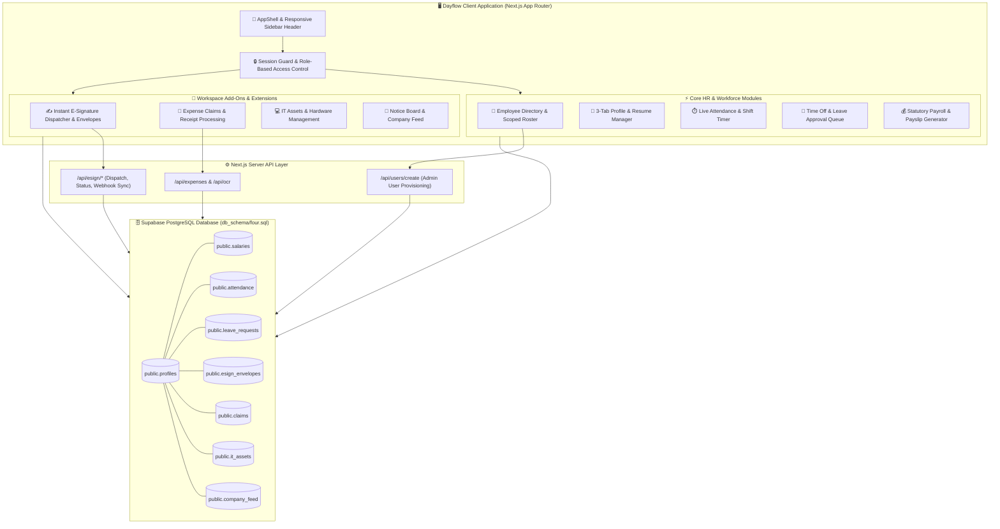

# Dayflow HRMS — Human Resource Management System

[](https://nextjs.org/)
[](https://www.typescriptlang.org/)
[](https://tailwindcss.com/)
[](https://supabase.com/)

**Dayflow HRMS** (*Every workday, perfectly aligned.*) is an enterprise-grade Human Resource Management System designed to streamline employee onboarding, live shift punching, statutory salary calculation, instant document e-signatures, expense claims, IT asset management, and leave approval workflows in a modern, high-contrast monochrome design system.

---

## 📐 System Architecture & Module Flow

The system orchestrates role-based access control (Admin vs. Employee), session security, server API provisioning, and real-time state synchronization with Supabase PostgreSQL:



---

## ✨ Core Features & Functionality

### 👥 Employee Directory & Admin Onboarding
- **Clean Human-Readable URLs**: Navigates profiles seamlessly via employee Login IDs (e.g. `/employees/OIMACH20260003`) with fallback UUID resolution.
- **Admin User Provisioning**: High-privilege API endpoint (`/api/users/create`) creates `auth.users`, `profiles`, and `salaries` rows in Supabase concurrently.
- **Automated Login ID Generator**: Formats structured Login IDs (`OI` + Initials + Year + Sequence, e.g. `OISAJE20260001`).
- **Live Status Badges**: Displays real-time presence indicators (🟢 Present, 🟡 Absent, 🌓 Half-Day, ✈️ On Leave).
- **Search & Filters**: Instant search by name, Login ID, or email with department filtering.

### 👤 Profile & Resume Management
- **General Tab**: Bio, work responsibilities, hobbies, skills, certifications, department, position, and manager structure.
- **Private Info Tab**: PAN Number, UAN Number, Date of Birth, Marital Status, residing address, and bank details.
- **Salary Info Tab**: Admin-restricted statutory salary breakdown with one-click printable payslip modal generation.

### ⏱️ Attendance & Live Shift Tracking
- **Live Shift Timer**: Header check in / check out pill with live elapsed counter and notes logging.
- **Shift Matrix**: Daily organizational view for HR with date selectors and workforce status tallies.
- **Half-Day & Break Tracking**: Supports half-day shift logging and break time records.

### 💰 Statutory Salary Engine & Payslip Generator
- **Flexible Wage Inputs**: Toggle between Monthly Wage and Annual CTC.
- **Automated Statutory Calculation**: Auto-calculates Basic (50%), HRA (25%), Standard Allowance (15%), PF (5%), and Professional Tax (5%).
- **Printable Payslip Modal**: Generate and print official payslips directly from the browser.

### ✍️ E-Signature Module (DocuSeal Powered)
- **2-Step Instant Dispatcher**: Upload PDF document $\rightarrow$ configure signer role & drag-and-drop interactive fields (*Signature, Name, Initial, Date*).
- **Envelope Dashboard**: Track sent documents, view envelope status (*draft, sent, completed, declined*), and download signed PDFs.
- **Webhook Synchronization**: Webhook endpoint (`/api/esign/webhook`) syncs execution status automatically.

### 🧾 Expenses & Reimbursements
- **Expense Claim Submission**: Submit reimbursement claims with file receipts, categories, and amounts.
- **Approval Workflow**: Admin approval & rejection management with comment tracking.

### 💻 IT Assets Management
- **Hardware Roster**: Track company-owned laptops, monitors, accessories, serial numbers, and assignment statuses.

### 📢 Notice Board & Feed
- **Company Announcements**: Post organization-wide notices and keep team members updated.

---

## 🛠️ Technology Stack

| Layer | Technologies |
|---|---|
| **Framework** | Next.js 16 (App Router), React 19, TypeScript |
| **Styling** | Vanilla CSS Design System, Tailwind CSS, Lucide Icons |
| **Database** | Supabase PostgreSQL (`db_schema/four.sql`) |
| **Authentication** | Custom Session Management & Supabase Auth Integration |
| **E-Sign Provider** | DocuSeal API Integration |

---

## 🗄️ Database Setup (`db_schema/four.sql`)

The database schema is consolidated in [`db_schema/four.sql`](file:///home/adi/Desktop/Hackathons/hrms/db_schema/four.sql).

### Key Tables
1. `profiles`: Employee directory, login ID, role, personal info, active status.
2. `salaries`: Salary breakdown (fixed wage, basic, HRA, allowance, PF, tax).
3. `attendance`: Check-in/check-out timestamps, date, elapsed seconds.
4. `leave_requests`: Paid time-off & sick leave requests with approval status.
5. `esign_envelopes`: E-signature envelope tracker with JSONB field coordinates.
6. `claims`: Expense reimbursement records.
7. `it_assets`: Company asset allocation.
8. `company_feed`: Internal notice board posts.

### Running SQL Migrations
1. Open your **Supabase Dashboard** $\rightarrow$ **SQL Editor**.
2. Copy the contents of [`db_schema/four.sql`](file:///home/adi/Desktop/Hackathons/hrms/db_schema/four.sql).
3. Paste and click **Run**.

---

## 🚀 Quick Start

### 1. Clone & Install
```bash
git clone https://github.com/KarthikeyanMahendran/oodo-hackathon.git
cd hrms
npm install
```

### 2. Environment Configuration
Create a `.env.local` file in the project root:
```env
NEXT_PUBLIC_SUPABASE_URL=https://xczcsqaxgbgwlhzhgldi.supabase.co
NEXT_PUBLIC_SUPABASE_ANON_KEY=your_supabase_anon_key
SUPABASE_SERVICE_ROLE_KEY=your_supabase_service_role_key
DOCUSEAL_API_KEY=your_docuseal_api_key
```

### 3. Run Development Server
```bash
npm run dev
```
Open [http://localhost:3000](http://localhost:3000) in your browser.

### 4. Build Verification
```bash
npm run build
```
